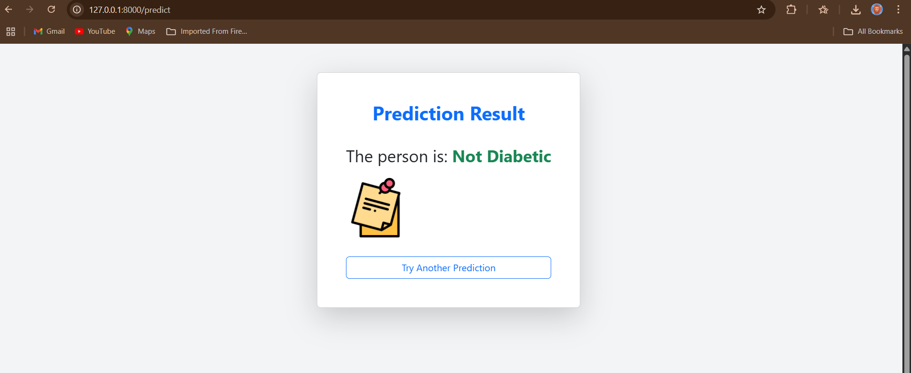
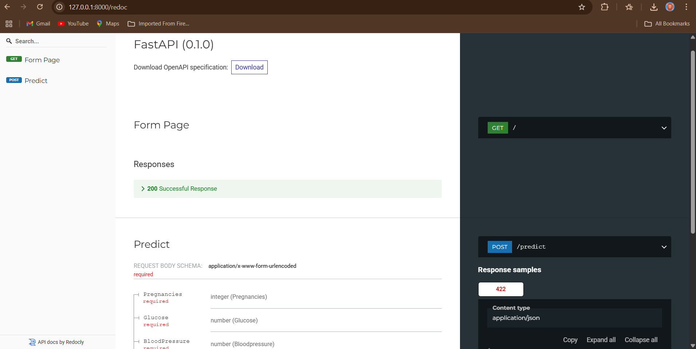

# 🩺 Diabetes Prediction Web App

This is a web-based application built with **FastAPI** that uses a **Random Forest Classifier** to predict whether a person is diabetic based on key medical inputs. The app provides both a **REST API** and an interactive **web interface** with a modern, responsive UI.

---

## 🚀 Features

- Trained on the **Pima Indians Diabetes dataset**
- Built with **FastAPI**, **scikit-learn**, and **Bootstrap 5**
- Clean and dynamic **web UI** with animations
- Model persisted with `joblib`
- Supports both **JSON API** and **HTML forms**
- Easy to run locally

---

## 🧠 ML Model

The model is a **Random Forest Classifier** trained on selected features:

- Pregnancies
- Glucose
- BloodPressure
- BMI
- Age

Training is done in `train.py` using a dataset hosted on [Plotly's public repo](https://raw.githubusercontent.com/plotly/datasets/master/diabetes.csv).

---

## 📁 Project Structure

```bash
diabetes-prediction-app/
│
├── main.py # FastAPI app with API and Web routes
├── train.py # Script to train and export model
├── diabetes_model.pkl # Saved Random Forest model
├── templates/ # HTML templates for UI
│ ├── form.html
│ └── result.html
└── README.md
```
## ⚙️ Requirements

Install dependencies:
```bash
pip install -r requirements.txt

Or manually:

pip install fastapi uvicorn scikit-learn pandas joblib jinja2 python-multipart

```
🛠️ Model Training:

Run the training script to generate the model file:

```bash
python train.py
```
This will create diabetes_model.pkl

🌐 Run the Web App

Start the FastAPI server:
```bash
uvicorn main:app --reload
```
Visit: http://127.0.0.1:8000 for the web interface

🖥️ Web UI Preview
⚡ A beautiful responsive interface built with Bootstrap 5 + Animate.css

🎯 Prediction Form:


📊 Prediction Result:




🎨 Technologies Used:

FastAPI

scikit-learn

Bootstrap 5

Animate.css

Jinja2 Templates

Joblib

📌 To-Do / Future Work:

Add confidence scores using predict_proba()

Add charts/analytics using Chart.js

Add user session support and database logging

Deploy on Render / Vercel / AWS

🧑‍💻 Author
Narasimha Reddy Asam


